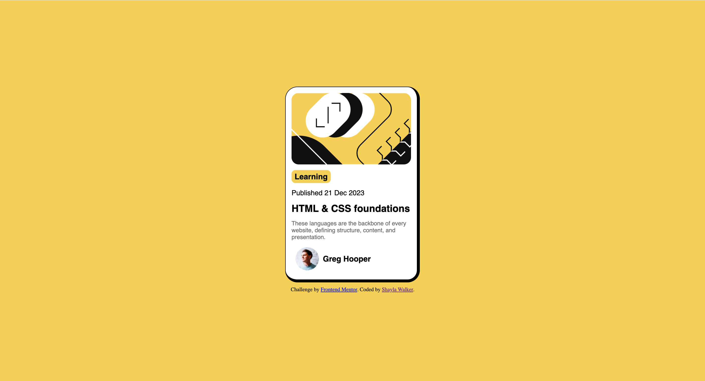

# Frontend Mentor - Blog preview card solution

This is a solution to the [Blog preview card challenge on Frontend Mentor](https://www.frontendmentor.io/challenges/blog-preview-card-ckPaj01IcS). Frontend Mentor challenges help you improve your coding skills by building realistic projects. 

## Table of contents

- [Overview](#overview)
  - [The challenge](#the-challenge)
  - [Screenshot](#screenshot)
  - [Links](#links)
- [My process](#my-process)
  - [Built with](#built-with)
  - [What I learned](#what-i-learned)
- [Author](#author)

## Overview

This project is a visually appealing blog preview card designed to showcase a blog post, highlighting its title, publication date, category, a brief description, and the author's profile picture. It combines HTML, CSS, and SVG for an engaging presentation.

### The challenge

Blog preview card

### Screenshot

### Links

- Live Site URL: [GitHub Pages](https://shaywalker5.github.io/Blog-preview-card/)

## My process

### Built with

- Semantic HTML5 markup
- CSS custom properties
- Flexbox
- CSS Grid
- [Styled Components](https://styled-components.com/) - For styles

### What I learned

- I explored using SVG graphics to create custom visual elements, which allows for scalable and resolution-independent designs that enhance the overall aesthetic of the card. 
- I practiced implementing responsive design principles, ensuring the card maintains its visual appeal and usability across various screen sizes.
- I became more aware of accessibility practices, such as focus states, which make the card usable for individuals who rely on keyboard navigation.

## Author

- LinkedIn - [Shayla Walker](https://www.linkedin.com/in/shaylavwalker)
- Frontend Mentor - [@shaywalker5](https://www.frontendmentor.io/profile/shaywalker5)

